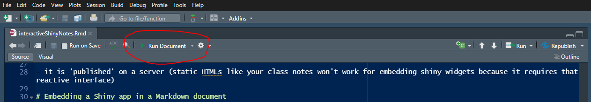
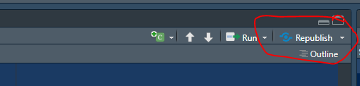

```{r setup, include=FALSE}
knitr::opts_chunk$set(echo = TRUE)
```

<br>


# Interactive documents


This is an interactive document showing how you can create interactive documents `r emoji::emoji("wink")`. The source code for this file is in [this GitHub repo](https://github.com/MargaretSiple-NOAA/interactiveShinyNotes).
A
Markdown document with shiny widgets and outputs is called an "interactive document." 

You can embed a Shiny app in a Markdown / Quarto page. Think of a report where perhaps you want to share a lot of results, but allow the report's readers to examine different parts of the dataset, different relationships, etc.

It operates more like a Shiny app than your traditional static Markdown file:

- it is 'published' on a server (static HTMLs like your class notes won't work for embedding shiny widgets because it requires that reactive interface)
- when you render the document, you are *deploying* the document (not knitting a static HTML file)

# Embedding a Shiny app in a Markdown document

## Doc setup

To make a Markdown document interactive, you add the following to the yaml header:

```{r eval = FALSE}
---
runtime: shiny
output:html_document
---
```

Once you do this, an icon will appear at the top that says "Run Document" instead of "Knit":



## Code

### Inline Shiny app

You can embed your shiny app of choice with an inline chunk, like this:

```{r, eval=FALSE}
library(palmerpenguins)
library(ggplot2)
library(shiny)
shinyApp(
  ui = fluidPage(
    checkboxGroupInput(
      inputId = "species",
      label = "Penguin species:",
      c(
        "Gentoo" = "Gentoo",
        "Adelie" = "Adelie",
        "Chinstrap" = "Chinstrap"
      ),
      selected = c("Gentoo", "Adelie")
    ),
    plotOutput("penguinPlot")
  ),
  server = function(input, output) {
    output$penguinPlot <- renderPlot({
      penguins_plot <- subset(penguins, species == input$species)
      p1 <- ggplot(
        penguins_plot,
        aes(x = bill_length_mm, y = bill_depth_mm, color = species)
      ) +
        geom_point(size = 4) +
        scale_color_brewer(palette = "Dark2") +
        ylab("Bill depth (mm)") +
        xlab("Bill length (mm)") +
        theme_light(base_size = 14)
      p1
    })
  },
  options = list(height = 500)
)
```

To get an embedded app that looks like this:
```{r, echo=FALSE}
library(palmerpenguins)
library(ggplot2)
library(shiny)
shinyApp(
  ui = fluidPage(
    checkboxGroupInput(
      inputId = "species",
      label = "Penguin species:",
      c(
        "Gentoo" = "Gentoo",
        "Adelie" = "Adelie",
        "Chinstrap" = "Chinstrap"
      ),
      selected = c("Gentoo", "Adelie")
    ),
    plotOutput("penguinPlot")
  ),
  server = function(input, output) {
    output$penguinPlot <- renderPlot({
      penguins_plot <- subset(penguins, species == input$species)
      p1 <- ggplot(
        penguins_plot,
        aes(x = bill_length_mm, y = bill_depth_mm, color = species)
      ) +
        geom_point(size = 4) +
        scale_color_brewer(palette = "Dark2") +
        ylab("Bill depth (mm)") +
        xlab("Bill length (mm)") +
        theme_light(base_size = 14)
      p1
    })
  },
  options = list(height = 500)
)
```

### Shiny app in another directory 

You can also call a Shiny app defined in another directory; it would look like this:

```{r eval=FALSE}
library(shiny)
shinyAppDir(
  system.file("examples/01_hello", package="shiny"),
  options = list(width = "100%", height = 700)
)
```


<div class="boxy boxy-orange boxy-lightbulb">
**Note:** "showcase mode" (the shiny interface that shows both ui and code at the same time) won't work in Markdown docs.
</div>


## Suggested workflow

If you are making a version-controlled interactive document, this is the workflow I suggest:

1) Create a github repo
2) Under the green "Code" button, copy the HTTPS text
3) In RStudio, go to File --> New Project --> Version control and paste in that text (make sure you choose a directory that makes sense)
4) In your new project, make sure you have a folder called "www" to contain your static images. 
5) You can embed your app a few ways, so the scripts you have in the project directory will differ depending on what you want to do. But you need to at least have an Rmd with the `runtime: shiny` element in the yaml header.
6) When you're ready to publish your document, you'll need to make sure you're logged into the account where you want to publish (for example, this file is published on the free shiny server, shinyapps.io). Publish it like you would a shiny app: run the doc, and click the "Publish" button in the top right of the window. 
7) Changes you've made to the Rmd will not appear online until you "republish":



